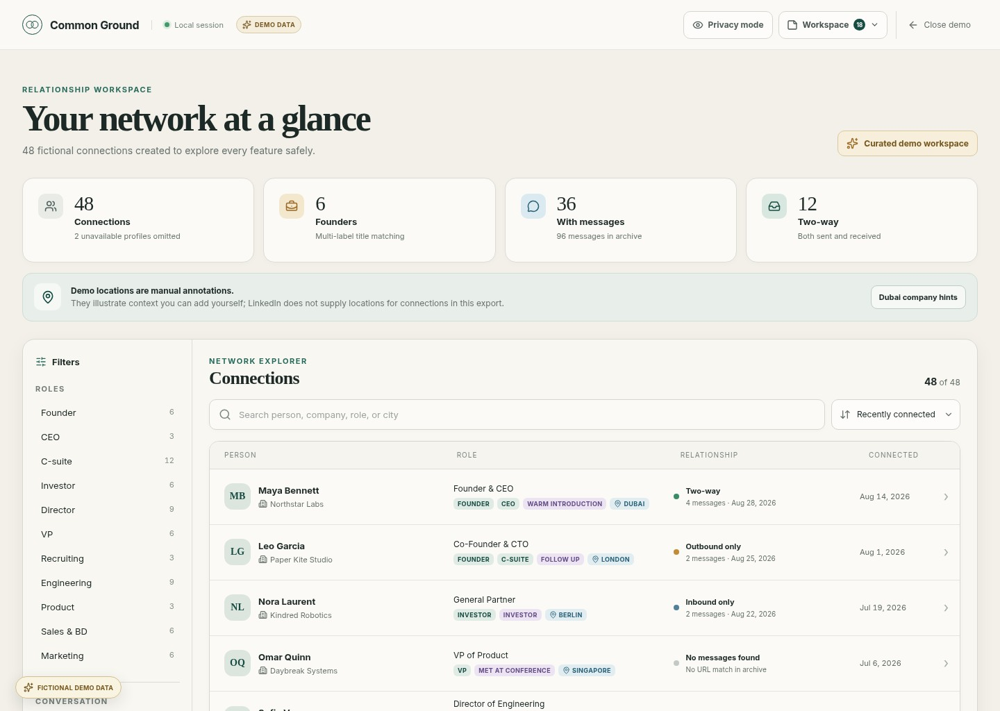
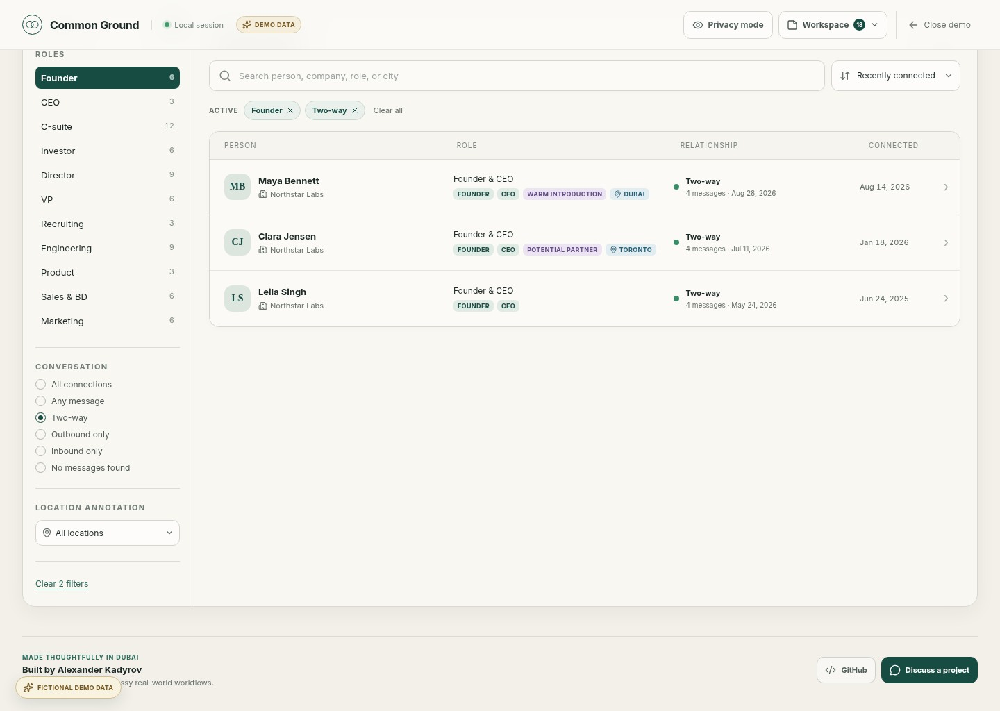
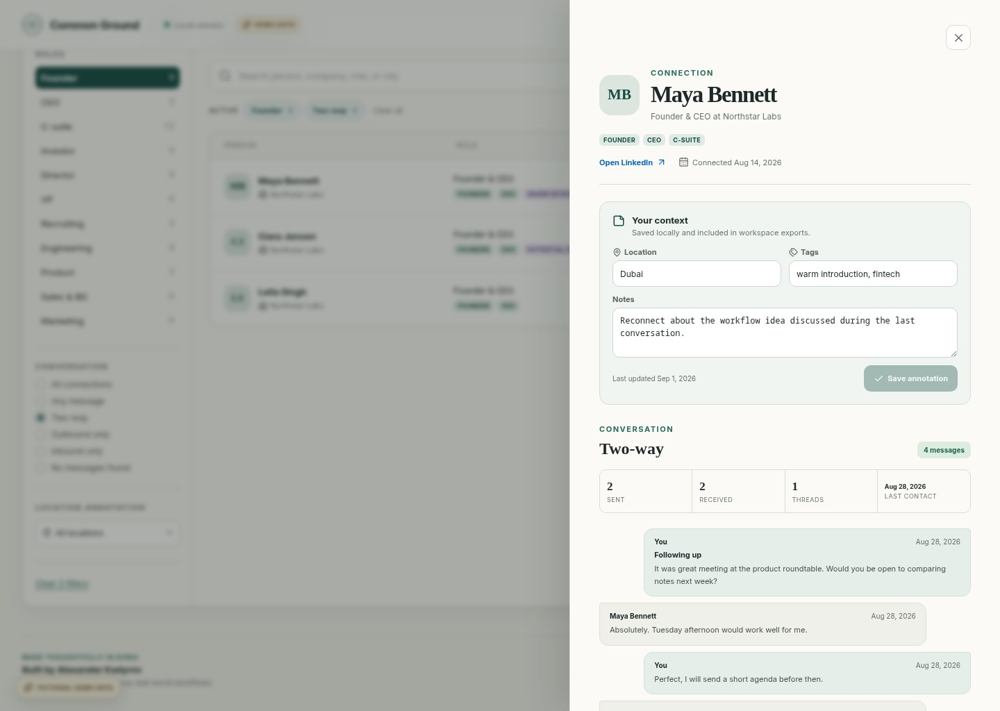
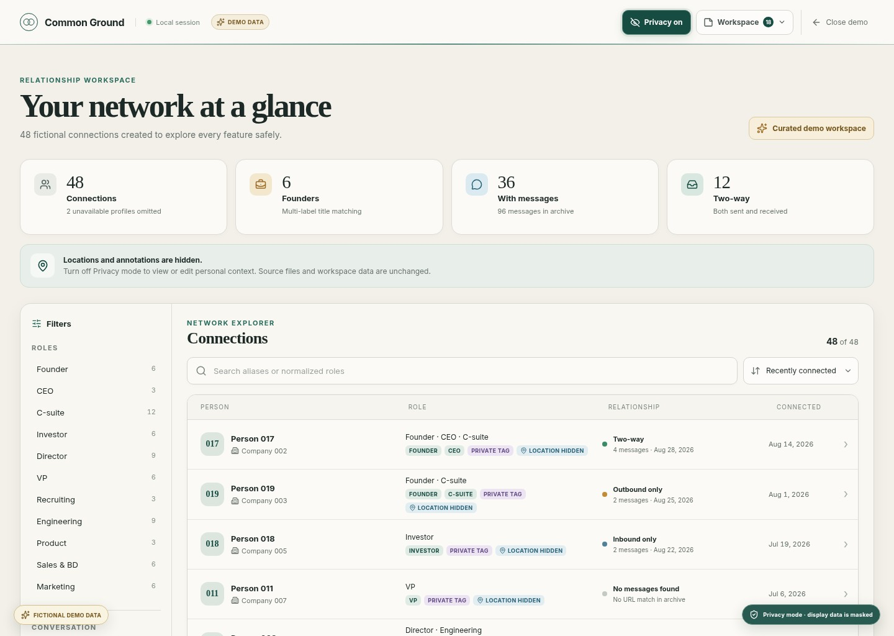

# Common Ground

A private, browser-only relationship workspace for a LinkedIn personal data export.

[Try the live demo](https://gruz0.github.io/linkedin-relationship-navigator/) · [Connect with Alexander Kadyrov](https://www.linkedin.com/in/alexanderkadyrov/) · [View the source](https://github.com/gruz0/linkedin-relationship-navigator)



## Why it exists

LinkedIn lets people download their professional network as a ZIP full of CSV files, but the export does not readily answer the questions that make the data useful:

- Which founders am I connected to?
- Who have I actually spoken with?
- Which relationships might be worth revisiting?

Common Ground turns that export into a searchable workspace without sending it to a server. Visitors without an export can explore the complete product through a clearly labeled fictional demo.

## What it supports

- Search connections by name, company, title, normalized role, and personal context
- Filter relationships as two-way, outbound-only, inbound-only, or no message found
- View message counts, recency, threads, and conversation history
- Add private locations, tags, and notes in browser storage
- Export and restore annotations with a versioned workspace file
- Mask identifying information with a privacy-first presentation mode
- Identify company names that mention Dubai without treating them as a person's location

## Inside the workspace

### Turn a broad network into a useful answer

Filters can be combined and removed individually. This fictional example finds founders with a two-way conversation history.



### Keep relationship context beside the conversation

The person drawer brings together annotations, relationship metrics, connection dates, and matching exported messages.



### Present the product without exposing real contacts

Uploaded archives start in Privacy mode. Names, companies, raw titles, locations, notes, profile links, and message content remain hidden until deliberately revealed.



## Data and privacy

The ZIP archive is parsed in the browser and is never uploaded by this application. Privacy mode changes only what is rendered; it does not modify the source archive or workspace exports and is not a substitute for sanitizing files before sharing them.

LinkedIn does not include connection locations in this export. “No messages found” means no matching profile URL was present in the exported message history; it is not proof that two people have never spoken elsewhere.

Workspace exports contain annotations and basic source-archive metadata. They do not contain LinkedIn message bodies.

## Run locally

Requires [Bun](https://bun.sh/) 1.3.14 or later.

```bash
bun install
bun run dev
```

Open the local address printed by Vite, then choose a complete ZIP downloaded from LinkedIn or open the fictional demo workspace.

## Verification

```bash
bun run test
bun run build
```

## Refresh showcase images

With Google Chrome installed, regenerate every screenshot and the social-preview image from the deterministic fictional demo:

```bash
bun run capture:showcase
```

The script starts a local Vite server, drives it with Playwright, and writes the assets to `public/showcase`.

## Deployment

Pushes to `master` are tested, built with Bun 1.3.14, and deployed to GitHub Pages by the repository workflow.

Common Ground is an independent project and is not affiliated with LinkedIn.
