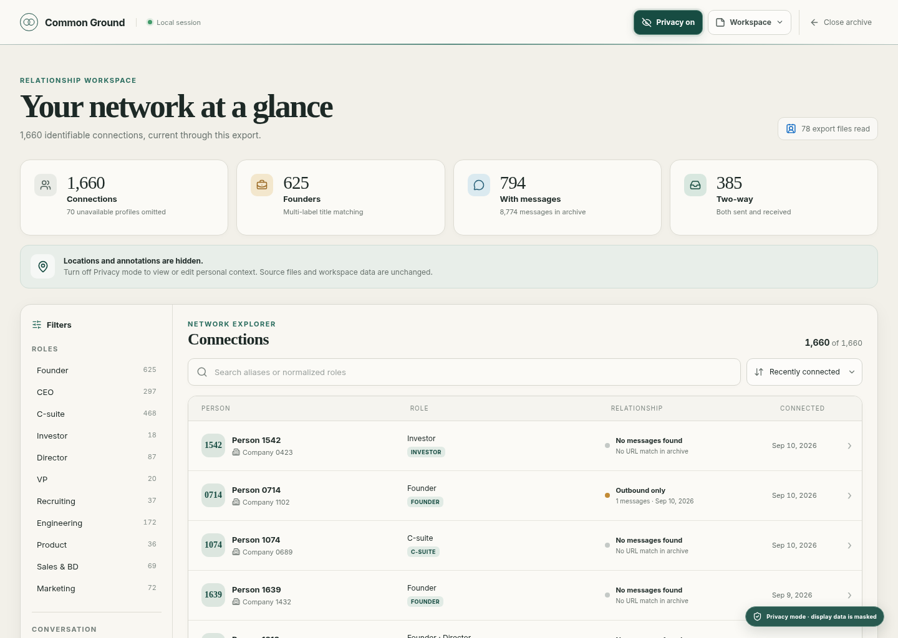
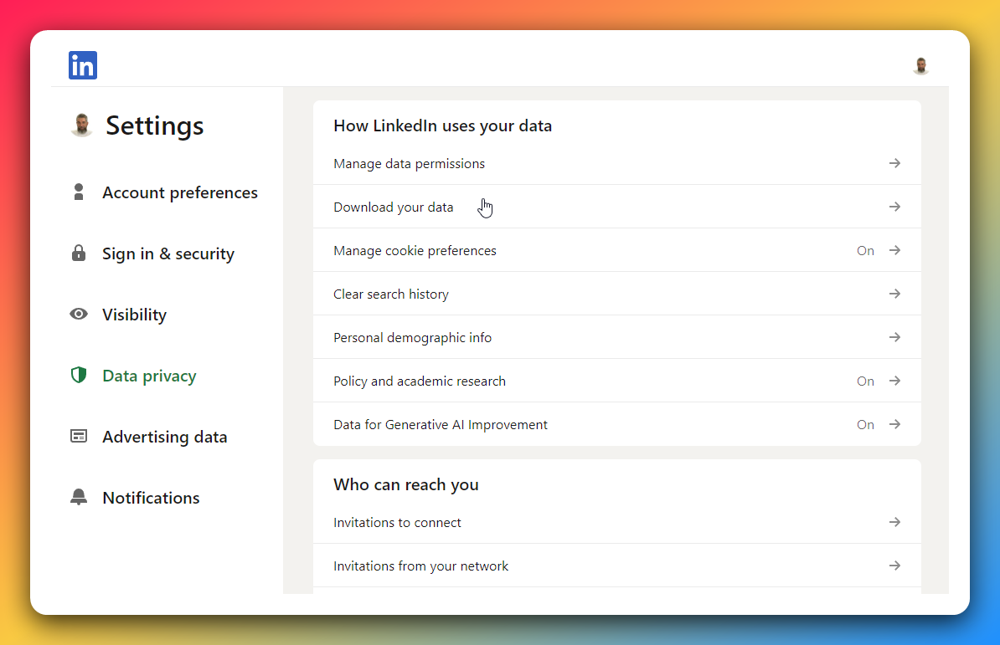
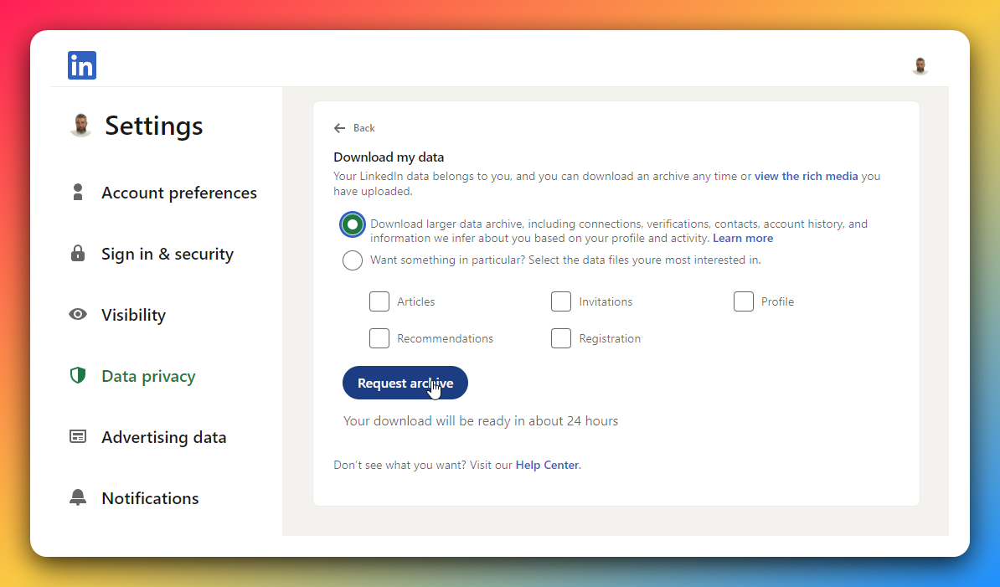
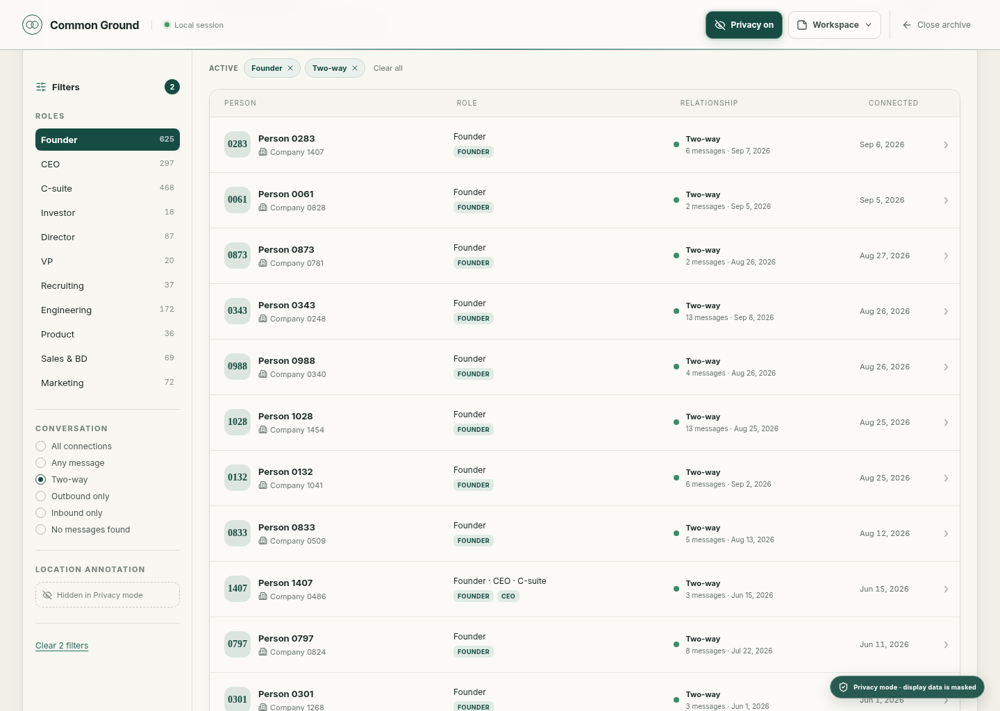
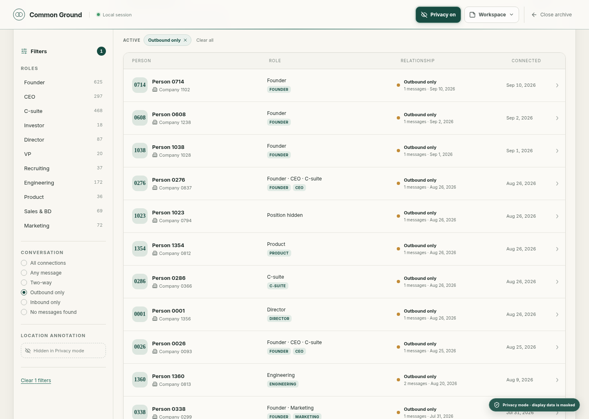
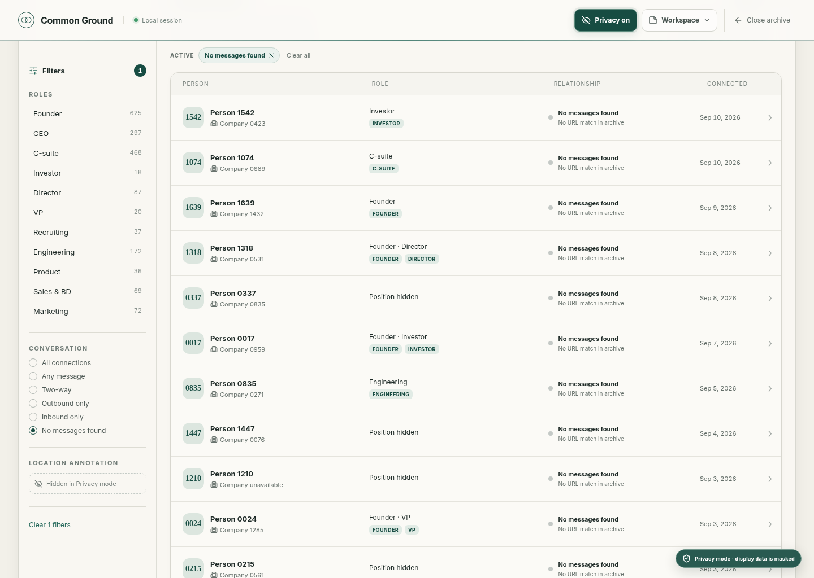
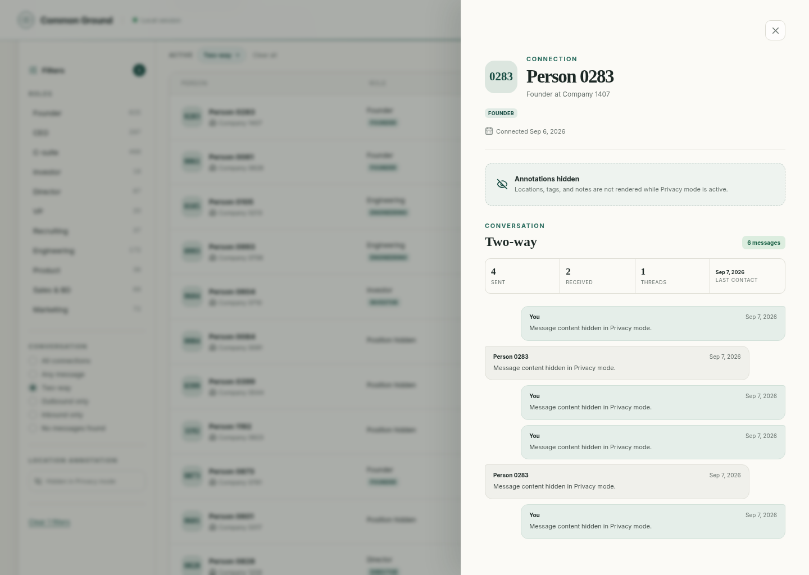
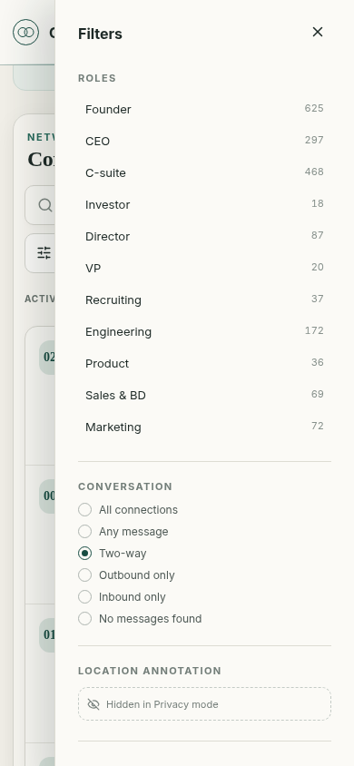

# Common Ground

A private, browser-only relationship workspace for a LinkedIn personal data export.

[Try the live demo](https://gruz0.github.io/linkedin-relationship-navigator/) · [Connect with Alexander Kadyrov](https://www.linkedin.com/in/alexanderkadyrov/) · [View the source](https://github.com/gruz0/linkedin-relationship-navigator)



The screenshots in this README come from the creator’s real LinkedIn export with Privacy mode enabled. Aggregate counts and relationship patterns are real; names, companies, raw titles, locations, notes, profile links, and message content are masked.

## Why it exists

LinkedIn lets people download their professional network as a ZIP full of CSV files, but the export does not readily answer the questions that make the data useful:

- Which founders have I actually spoken with?
- Who did I contact without receiving a reply?
- Which connections have no matching conversation?

Common Ground turns that export into a searchable workspace without sending it to a server. Visitors without an export can explore the complete product through a clearly labeled fictional demo.

## Get your LinkedIn export

Use LinkedIn on desktop to request the larger account-data archive:

1. Open **Settings & Privacy → Data privacy → Download your data**.

   

2. Select the larger data archive, click **Request archive**, and wait for LinkedIn’s email.

   

> **Allow up to 24 hours.** LinkedIn may prepare a request in stages, so do not assume the first notification contains the complete archive. If several notifications arrive, wait for the larger archive. LinkedIn currently keeps the download link active for 72 hours.

It is worth making a fresh export periodically. The ZIP is a user-owned snapshot of your professional data if you later lose access to the account. It also contains sensitive personal data, so store the backup securely and never commit it to a repository.

See [LinkedIn’s current download instructions](https://www.linkedin.com/help/linkedin/answer/a1339364) if its interface or delivery process changes.

## What it supports

- Search connections by name, company, title, normalized role, and personal context
- Filter relationships as two-way, outbound-only, inbound-only, or no message found
- Filter conversations by recency, message depth, thread count, and who sent the latest archived message
- View message counts, recency, threads, and conversation history
- Open explicit HTTP(S) links from visible message history without interpreting message text as HTML
- Add private locations, tags, and notes in browser storage
- Export and restore annotations with a versioned workspace file
- Mask identifying information with a privacy-first presentation mode
- Identify company names that mention Dubai without treating them as a person's location

## Proven on a real network

### Which founders have I actually spoken with?

Combining role and conversation filters turns 1,660 connections into a shortlist of 140 founders with matched two-way conversation history.



### Who did I contact without receiving a reply?

The outbound-only view surfaces relationships where the archive contains sent messages but no matched reply.



### Which connections have no matching conversation?

This view distinguishes accumulated LinkedIn connections from relationships with conversation evidence in the export.



### What is the evidence behind one relationship?

The person drawer brings together direction, message counts, threads, recency, and connection date while Privacy mode keeps identifying details and content hidden.



### Does the workflow remain usable on mobile?

The full role and conversation filter set is available from a dedicated mobile panel.



## Data and privacy

The ZIP archive is parsed in the browser and is never uploaded by this application. Privacy mode changes only what is rendered; it does not modify the source archive or workspace exports and is not a substitute for sanitizing files before sharing them.

LinkedIn does not include connection locations in this export. “No messages found” means no matching profile URL was present in the exported message history; it is not proof that two people have never spoken elsewhere.

Workspace exports contain annotations and basic source-archive metadata. They do not contain LinkedIn message bodies.

## Run locally

```bash
bun install
bun run dev
```

Open the local address printed by Vite, then choose a complete ZIP downloaded from LinkedIn or open the fictional demo workspace.

## Contributing

See [CONTRIBUTING.md](CONTRIBUTING.md) for prerequisites, project scripts, testing, showcase-image generation, and deployment notes.

Common Ground is an independent project and is not affiliated with LinkedIn.
